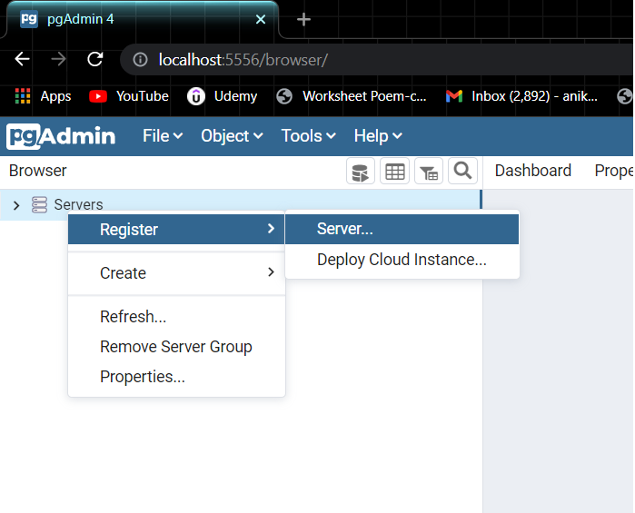
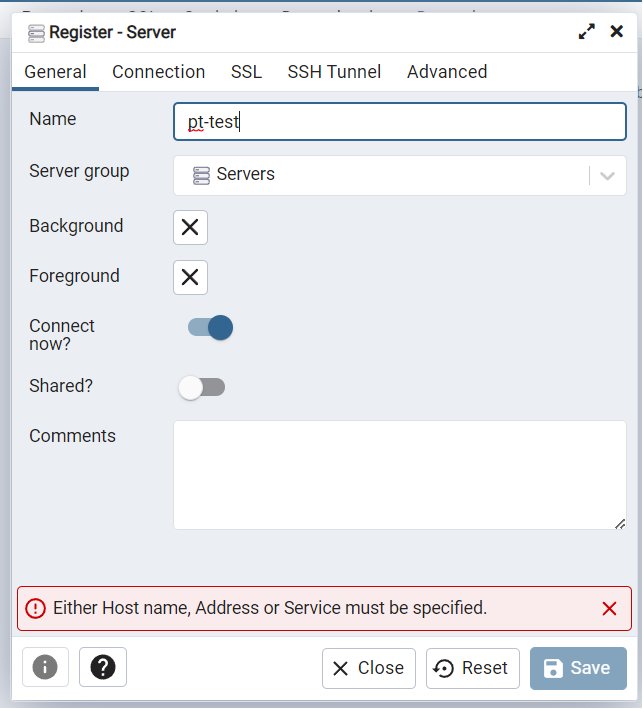
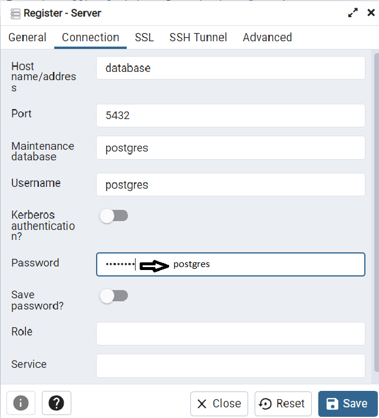

# CO2 Emission ETL

This project is a Near Real-Time ETL pipeline that will do the necessary transformations of the raw data which is in the form of CSV files, the end goal here is to be able to calculate the total emission on a brand level, car level, and driver level. There are a lot of different tools and frameworks that are used to build ETL pipelines. In this project, the ETL is built using Python, Docker, PostgreSQL, and Airflow.

## Setup

1. Make sure you have [Docker](https://docs.docker.com/engine/install/) installed on your machine.
2. Change directories at the command line to be inside the `emission-etl` folder
```bash
cd emission-etl
```
3. Now run, 
```
docker-compose up
```
4. Now three services will get initialized, Jupyter Lab(for testing), Postgres Database, and Pgadmin webserver to run queries on our tables.

      - We can access Jupyter Lab at [http://localhost:8080/](http://localhost:8080/)
      - Let's look at our database inside the pgadmin webserver 
        - Go to [http://localhost:5556/](http://localhost:5556/) and log in with the following credentials.
        ```
        email id: aniket@gmail.com
        password: password
        ```
        - Then follow the images for the next steps.

        

        

        
        
        _Note: The database planetly will get initialized automatically at startup. If there are tables already existing inside the database then please DROP the tables before running the etl_
       
        - If you want you can start doing the testing inside the Jupyter Lab, all the required libraries to import are present in the [requirement.txt](requirements.txt), inside the first cell execute.
        ```python
        !pip install -r requirements.txt
        ```
          and then you can start your testing.

5. Now, let's start our Airflow service.
   - First, we will have to initialize the Airflow so that the Airflow database and Airflow USER gets created. It will take around 1 minute.
     ```bash
     docker-compose -f airflow-docker-compose.yml up airflow-init
     ```
    - Once we have the Airflow database and the Airflow USER, we can start the Airflow services.
     ```bash
     docker-compose -f airflow-docker-compose.yml up
     ```
    - If you don't want to see the logs on cmd and you want to run it in the background just run the below command instead of the command mentioned above.
     ```bash
     docker-compose -f airflow-docker-compose.yml up -d
     ```
    - Now we can access our Airflow webserver at [http://localhost:8080](http://localhost:8080)
    - Now we can run the [emission-dag](http://localhost:8080/graph?dag_id=emission_dag) from the webserver.
    - You can check the source code in this file [emission-dag](dags/emission-dag.py)
## Notes
1. The incoming data is stored in the data/_tablename_incoming_data_/ whenever the ETL will run the data will move inside the used data folder with a timestamp attached to it as a suffix.
2. Right now while building the pipeline it is assumed that the drivers data and the vehicle_consumptions data are static.

## Improvements to do
1. Currently working on the use case where the drivers data and vehicle_consumptions data are not static.
